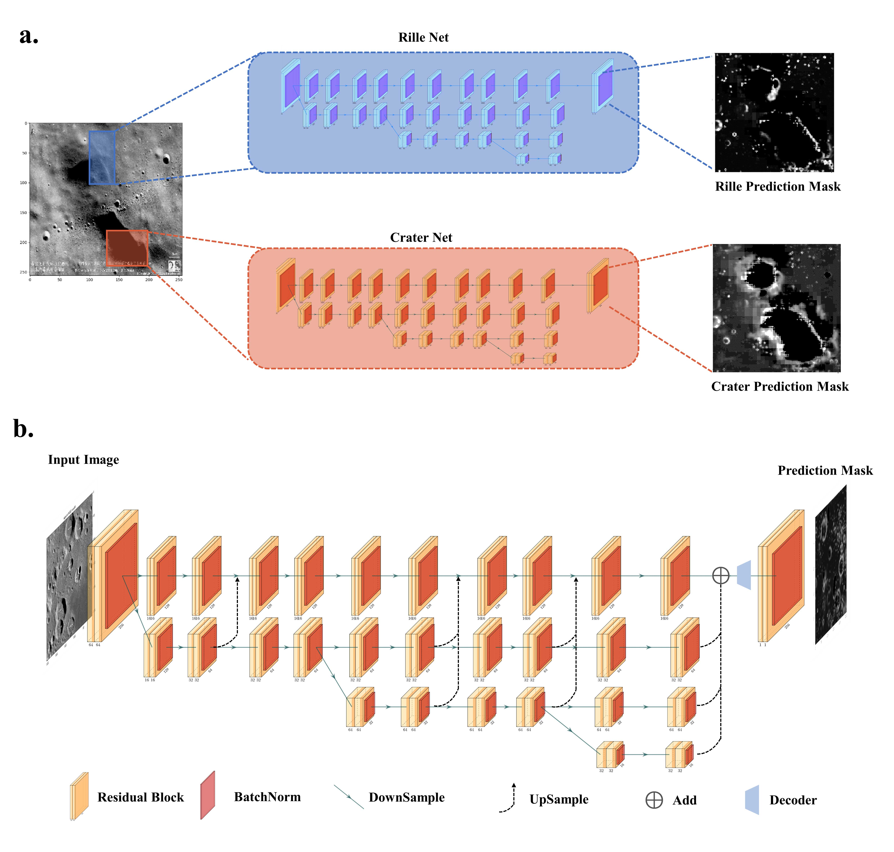
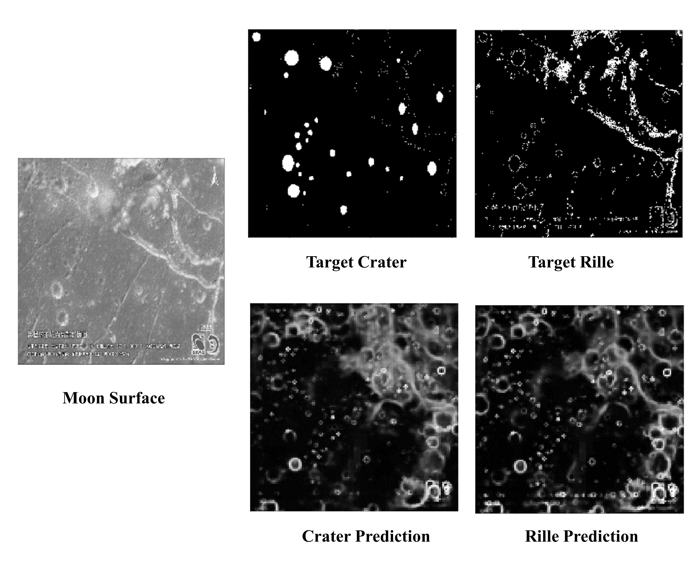

High-Resolution-MoonNet
===

## Introduction
This is a recurrent keras implementation of [Lunar Features Detection for Energy Discovery via Deep Learning]().

The main network structure is listed as below:
### Model
<div align="center">

</div>


### Results

<div align="center">

</div>

### Data Preparation
```
python data/deepmoon/get_hdf5_data.py
```

## Environment
The code is developed using python 3.6 on Ubuntu 16.04. NVIDIA GPUs are needed. The code is developed and tested using 4 NVIDIA P100 GPU cards. Other platforms or GPU cards are not fully tested.

## Training
**Moon DEM Dataset**
```
python train.py experiment/DeepMoon/High-resolution-net.json
```
**Surface Crack Dataset**
```
python train.py experiment/SurfaceCrack/High-resolution-net.json
```
**Assembled Dataset**
```
python train.py experiment/Assembled/Crack-High-resolution-net.json
python train.py experiment/Assembled/Crater-High-resolution-net.json
```


